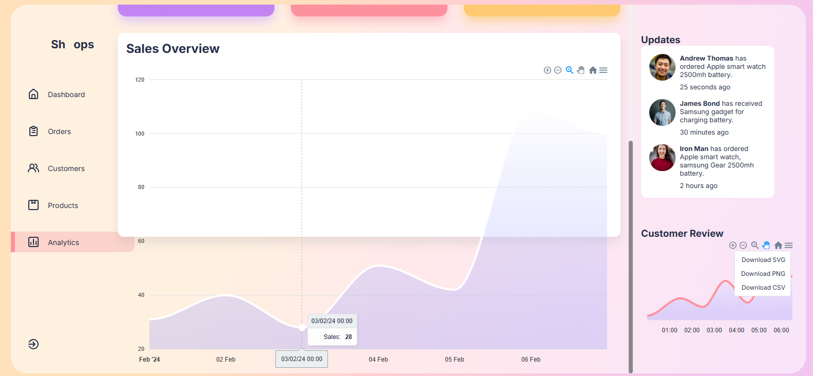
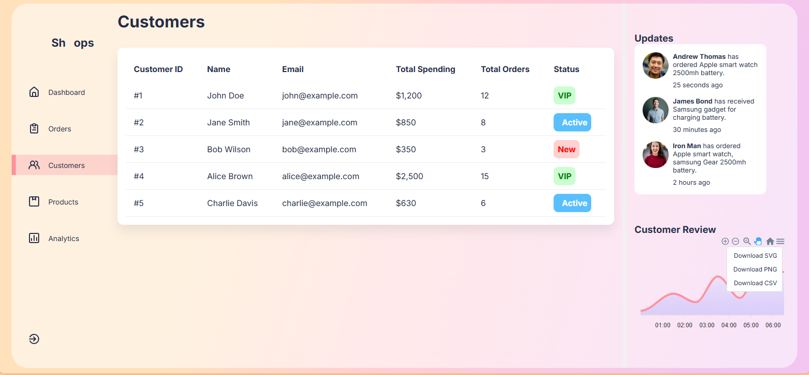

<div align="center">
      <h1> <br/>React Admin Dashboard</h1>
      <h3>A Modern Admin Dashboard with Analytics</h3>
</div>

<p align="center">
    <a href="https://your-dashboard-demo-link.com" target="_blank">
        
    </a>
    <a href="https://github.com/your-username" target="_blank">
        
    </a>
    <a href="https://linkedin.com/in/your-profile" target="_blank">
        
    </a>
</p>

# 📌 Overview

A feature-rich admin dashboard built with React.js, offering comprehensive analytics, user management, and business insights. The dashboard includes real-time data visualization, product management, order tracking, and customer analytics.

# 🛠️ Tech Stack


## 📸 Screenshots

### Authentication

<div align="center">
  
</div>

### Dashboard Overview

<div align="center">
  
</div>

### Analytics & Statistics

<div align="center">
  
  
  
  
</div>

### Business Management

<div align="center">
  
  
  
</div>

### Customer Insights

<div align="center">
  
</div>

## 🔑 Key Features

### Dashboard Analytics

- Real-time sales monitoring
- Revenue tracking
- Expense analysis
- Customer growth metrics

### Business Management

- Product inventory management
- Order processing and tracking
- Customer database
- User activity monitoring

### Data Visualization

- Interactive charts and graphs
- Progress tracking
- Performance metrics
- Sales forecasting

### Security Features

- Secure authentication
- Role-based access control
- Protected routes
- Session management

## 🚀 Getting Started

1. Clone the repository

```bash
git clone https://github.com/your-username/react-admin-dashboard.git
```

2. Install dependencies

```bash
cd react-admin-dashboard
npm install
```

3. Start the development server

```bash
npm start
```

4. Build for production

```bash
npm run build
```

## 🔐 Demo Access

```json
{
  "username": "admin",
  "password": "admin123"
}
```

## 📄 Project Structure

```
react-admin-dashboard/
├── src/
│   ├── components/
│   │   ├── Analytics/
│   │   ├── Dashboard/
│   │   ├── Orders/
│   │   ├── Products/
│   │   └── Customers/
│   ├── Data/
│   ├── imgs/
│   └── App.js
└── public/
```

## 👨‍💻 Developer Contact

Feel free to reach out for questions or collaboration:

- GitHub: [@your-username](https://github.com/your-username)
- LinkedIn: [Your Name](https://linkedin.com/in/your-profile)

## 🙏 Acknowledgments

Special thanks to:

- ApexCharts for data visualization
- Framer Motion for animations
- React Icons for the icon set
- All contributors and supporters
